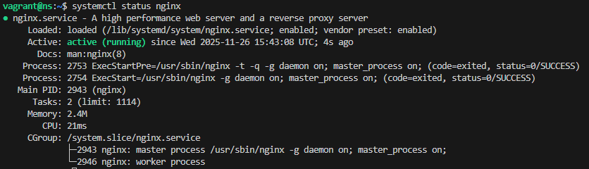
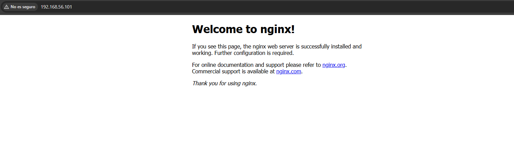
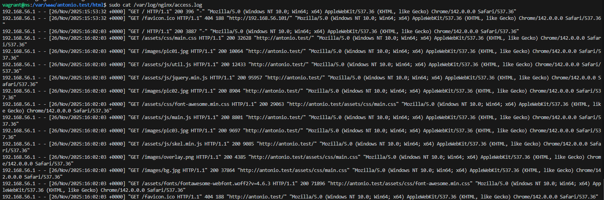
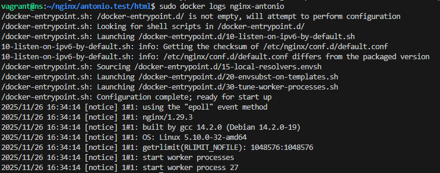
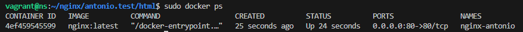
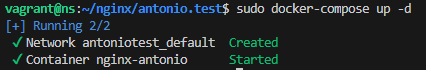
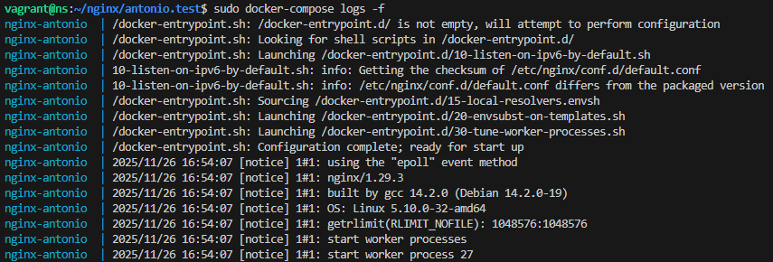
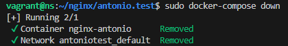

# Practica 2.1: Instalacion y Configuracion #

## 2. Instalación servidor web Nginx ##
El primer paso consite en actualizar los paquetes del vagrant y despues instalamos NGINX  

```
sudo apt update
sudo apt install nginx
```

Tras eso tenemos que verificar si se ha instalado
```
systemctl status nginx
```


## 3. Creación de las carpeta del sitio web ##
A continuacion tenemos que crear las carpetas, y clonar el repositorio:
```
sudo mkdir -p /var/www/antonio.test/html 
cd /var/www/antonio.test/html
git clone https://github.com/cloudacademy/static-website-example
```

Una vez creado y clonado tenemos que dar los permisos: 
```
sudo chown -R www-data:www-data /var/www/antonio.test/html
sudo chmod -R 755 /var/www/antonio.test
```

Y una vez que esta funcionado vemos que funciona entrando al enlace:

[https://IP-maq-virtual](https://IP-maq-virtual)



## 4. Configuración de servidor web NGINX ##

Despues tenemos que crear el archivo de configuracion:
```
sudo nano /etc/nginx/sites-available/antonio.test
```
Añadiendo dentro de el: 
```
server {
  listen 80;
  listen [::]:80;
  root /var/www/antonio.test/html; (Esta es nuestra ruta)
  index index.html index.htm index.nginx-debian.html;
  server_name example.test;
  location / {
  try_files $uri $uri/ =404;
  }
}
```

Y creamos un archivo simbolico entre este archivo y el de sitios que estan habilitados:
```
sudo ln -s /etc/nginx/sites-available/example.test /etc/nginx/sites-enabled/
sudo systemctl restart nginx
```

## 4.1. Comprobaciones ##
Ya que no tenemos un servidor DNS vamos a hacerlo de forma manual:
* Editando el archivo hosts de nuestra maquina anfitriona

Para ello tendremos que editar:  /etc/hosts y añadirle:
```
192.168.56.101 antonio.test
```


Tras todo esto comprobamos que todo se ha registrado correctamente:



---

# Practica 2.1: Instalacion y Configuracion  PARTE 2 #


## 2. Instalacion de Docker ##
El primer paso es asegurarse de que docker esta instalado
```
docker --version
```

## 3. Creacion de la estructura de carpetas del sitio web ##
En la maquina anfritiona cremaos la estructura de carpetas, y clonamos el repositorio:
```
mkdir -p ~/nginx/antonio.test/html 
mkdir -p ~/nginx/antonio.test/conf

cd ~/nginx/antonio.test/html
git clone https://github.com/cloudacademy/static-website-example .
```

## 4. Configuracion de servidor web NGINX con Docker ##
Ahora tenemos que crear el archivo de configuracion de NGINX : 

```
nano ~/nginx/antonio.test/conf/nginx.conf
```

Con el siguiente contenido: 
```
server {
  listen 80;
  listen [::]:80;
  root /usr/share/nginx/html; 
  index index.html index.htm index.nginx-debian.html;
  server_name antonio.test;
  location / {
  try_files $uri $uri/ =404;
  }
}
```

Tras esto creamos un contenedor Docker para ejecutar NGINX:
```
docker run -d \
  --name nginx-antonio \
  -p 80:80 \
  -v ~/nginx/antonio.test/html:/usr/share/nginx/html \
  -v ~/nginx/antonio.test/conf/nginx.conf:/etc/nginx/conf.d/default.conf \
  nginx:latest

```

Y ejecutamos los comandos para ver que el contenedor esta ejecutandose:



## 5. Comprobacion del funcionamiento ##
Para comprobar que el servidor esta funcionando lo podemos ver aqui:


A continuacion editamos el archivo /etc/hosts para asociar la IP con lo que añadimos esta linea:
```
127.0.0.1 antonio.test
```

## 6. Gestión del contenedor ##
Detenemos el contenedor Docker, y lo reiniciamos:
```
docker stop nginx-antonio
docker restart nginx-antonio
```
## 7. Alternativa: Usando docker-compose ##
Para cambiar la configuracion:
```
nano ~/nginx/antionio.test/docker-compose.yml
```

Con el siguiente contenido:

```
version: '3.8'
services:
  nginx:
  image: nginx:latest
  container_name: nginx-antionio
  ports:
  - "80:80"
  volumes:
  - ./html:/usr/share/nginx/html
  - ./conf/nginx.conf:/etc/nginx/conf.d/default.conf
  restart: unless-stopped
```

Para ejecutar el contenedor con docker-compose:
```
cd ~/nginx/antionio.test
docker-compose up -d
```



Para ver los logs:
```
docker-compose logs -f
```



Para detener los contenedores:
```
docker-compose down
```
