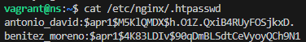
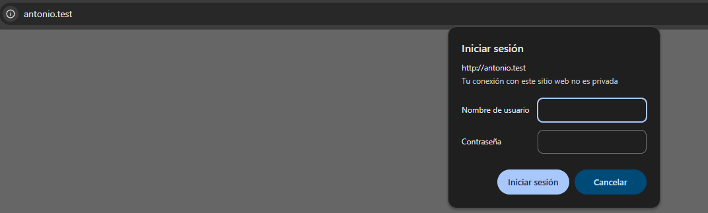
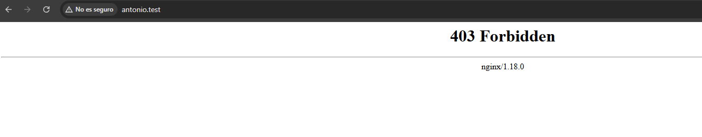
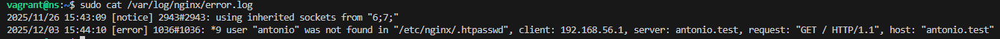
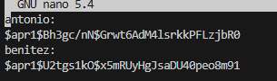
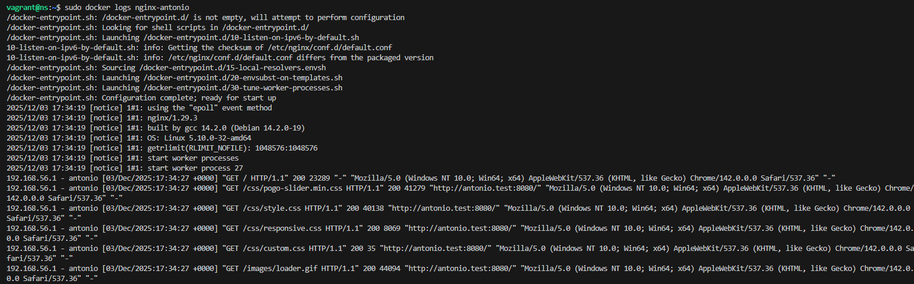
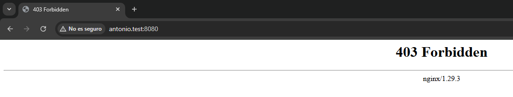

# Practica Realizada por :
DAVID MORENO LÓPEZ , 
ANTONIO BENITEZ GARCÍA

# Practica 2.1: Instalacion y Configuracion #

## 2. Instalación servidor web Nginx ##
El primer paso consite en actualizar los paquetes del vagrant y despues instalamos NGINX  

```
sudo apt update
sudo apt install nginx
```

Tras eso tenemos que verificar si se ha instalado
```
systemctl status nginx
```


## 3. Creación de las carpeta del sitio web ##
A continuacion tenemos que crear las carpetas, y clonar el repositorio:
```
sudo mkdir -p /var/www/antonio.test/html 
cd /var/www/antonio.test/html
git clone https://github.com/cloudacademy/static-website-example
```

Una vez creado y clonado tenemos que dar los permisos: 
```
sudo chown -R www-data:www-data /var/www/antonio.test/html
sudo chmod -R 755 /var/www/antonio.test
```

Y una vez que esta funcionado vemos que funciona entrando al enlace:

[https://IP-maq-virtual](https://IP-maq-virtual)


## 4. Configuración de servidor web NGINX ##

Despues tenemos que crear el archivo de configuracion:
```
sudo nano /etc/nginx/sites-available/antonio.test
```
Añadiendo dentro de el: 
```
server {
  listen 80;
  listen [::]:80;
  root /var/www/antonio.test/html; (Esta es nuestra ruta)
  index index.html index.htm index.nginx-debian.html;
  server_name example.test;
  location / {
  try_files $uri $uri/ =404;
  }
}
```

Y creamos un archivo simbolico entre este archivo y el de sitios que estan habilitados:
```
sudo ln -s /etc/nginx/sites-available/example.test /etc/nginx/sites-enabled/
sudo systemctl restart nginx
```

## 4.1. Comprobaciones ##
Ya que no tenemos un servidor DNS vamos a hacerlo de forma manual:
* Editando el archivo hosts de nuestra maquina anfitriona

Para ello tendremos que editar:  /etc/hosts y añadirle:
```
192.168.56.101 antonio.test
```


Tras todo esto comprobamos que todo se ha registrado correctamente:


---

# Practica 2.1: Instalacion y Configuracion  PARTE 2 #


## 2. Instalacion de Docker ##
El primer paso es asegurarse de que docker esta instalado
```
docker --version
```

## 3. Creacion de la estructura de carpetas del sitio web ##
En la maquina anfritiona cremaos la estructura de carpetas, y clonamos el repositorio:
```
mkdir -p ~/nginx/antonio.test/html 
mkdir -p ~/nginx/antonio.test/conf

cd ~/nginx/antonio.test/html
git clone https://github.com/cloudacademy/static-website-example .
```

## 4. Configuracion de servidor web NGINX con Docker ##
Ahora tenemos que crear el archivo de configuracion de NGINX : 

```
nano ~/nginx/antonio.test/conf/nginx.conf
```

Con el siguiente contenido: 
```
server {
  listen 80;
  listen [::]:80;
  root /usr/share/nginx/html; 
  index index.html index.htm index.nginx-debian.html;
  server_name antonio.test;
  location / {
  try_files $uri $uri/ =404;
  }
}
```

Tras esto creamos un contenedor Docker para ejecutar NGINX:
```
docker run -d \
  --name nginx-antonio \
  -p 80:80 \
  -v ~/nginx/antonio.test/html:/usr/share/nginx/html \
  -v ~/nginx/antonio.test/conf/nginx.conf:/etc/nginx/conf.d/default.conf \
  nginx:latest

```

Y ejecutamos los comandos para ver que el contenedor esta ejecutandose:


## 5. Comprobacion del funcionamiento ##
Para comprobar que el servidor esta funcionando lo podemos ver aqui:


A continuacion editamos el archivo /etc/hosts para asociar la IP con lo que añadimos esta linea:
```
127.0.0.1 antonio.test
```

## 6. Gestión del contenedor ##
Detenemos el contenedor Docker, y lo reiniciamos:
```
docker stop nginx-antonio
docker restart nginx-antonio
```
## 7. Alternativa: Usando docker-compose ##
Para cambiar la configuracion:
```
nano ~/nginx/antionio.test/docker-compose.yml
```

Con el siguiente contenido:

```
version: '3.8'
services:
  nginx:
  image: nginx:latest
  container_name: nginx-antionio
  ports:
  - "80:80"
  volumes:
  - ./html:/usr/share/nginx/html
  - ./conf/nginx.conf:/etc/nginx/conf.d/default.conf
  restart: unless-stopped
```

Para ejecutar el contenedor con docker-compose:
```
cd ~/nginx/antionio.test
docker-compose up -d
```


Para ver los logs:
```
docker-compose logs -f
```


Para detener los contenedores:
```
docker-compose down
```


# Practica 2.2: Autenticacion en Nginx #
El primer paso consiste en comprobar si tenemos los paquetes instalados:
```
dpkg -l | grep openssl
```

## 1.2. Creación de usuarios y contraseñas para el acceso web ##
Tenemos que crear un archivo : ``` .htpasswd ``` , con el siguiente contenido 
```
sudo sh -c "echo -n 'vuestro_nombre:' >> /etc/nginx/.htpasswd"

sudo sh -c "openssl passwd -apr1 >> /etc/nginx/.htpasswd"
```

y comprobamos que aparecen los usuarios :
```
cat /etc/nginx/.htpasswd
```


## 1.3. Configurando el servidor Nginx para usar autenticacion basica ##
Debemos editar la configuracion la configuracion del server block
```
sudo nano /etc/nginx/sites-available/antonio.test
```

Lo editamos con el siguiente contenido :
```
server {
  listen 80;
  listen [::]:80;
  root /var/www/antonio.test/html;
  index index.html index.htm index.nginx-debian.html;
  server_name antonio.test;
  location / {
  auth_basic "Area restringida";
  auth_basic_user_file /etc/nginx/.htpasswd;
  try_files $uri $uri/ =404;
  }
}
```
Y reiniciamos : 
```
sudo systemctl restart nginx
```
## 1.4. Probando la nueva configuracion ##
Tras todo esto entramos en antonio.test , y ponemos las credenciales:



## 2. Tareas ##

## 2.1. T.1. ##
Las capturas de pantalla de intentar entrar con un usuario valido y otro incorrecto estan en el paso anterior.

## 2.1. T.2. ##
Borramos las 2 lineas que hacen referencia  a la autenticacion basica en el location del directorio raiz, y añadimos un nuevo
location debajo de contact.html


## 2.3. Combinación de la autenticación básica con la restricción de acceso por IP ##
Debemos implementar 2 escenarios:

-  Un usuario debe estar ambas cosas, autenticado y tener una IP válida
-  Un usuario debe o bien estar autenticado, o bien tener una IP válida

Para ello hemos editado : ./conf/antonio.test.conf

## 3. Tareas ##
## 3.1. Tarea 1 ##
Ahora tenemos que configurar Nginx para que no deje acceder a la IP de la maquina anfritiona:



## 3.2. Tarea 2 ##
Ahora tenemos que configurar Nginx para que se tenga que tener una IP valida y un usuario valido:


# Practica 2.2: Autenticacion en Nginx #
Tenemos que usar las utilidades de OpenSSL:
```
docker pull stakater/ssl-certs-generator
```

## 1.2. Creación de usuarios y contraseñas para el acceso web ##
Creamos un archivo llamado "htpasswd"
```
mkdir -p ./conf
```
Y editamos htpasswd e incluimos:
```
mkdir -p ./conf
```
Tras esto tenemos que crear un password :
```
docker run --rm stakater/ssl-certs-generator openssl passwd -apr1 '1234' >>
htpasswd
```
Y tendremos esto:


Resultado tras crear los 2 usuarios:


## 1.3. Configurando el contenedor Nginx para usar autenticación básica ##
Editamos el archivo de configuración de Nginx:
```
docker run --rm --entrypoint=cat nginx /etc/nginx/conf.d/default.conf >
antionio.test.conf
```
Y editamos " conf/antonio.test.conf" añadiendo el siguiente contenido :
```
nano ./conf/antonio.test.conf


server {
  listen 80;
  listen [::]:80;
  root /usr/share/nginx/html; 
  index index.html index.htm index.nginx-debian.html;
  server_name antonio.test;
  location / {
  auth_basic "Área restringida";
  auth_basic_user_file /etc/nginx/.htpasswd; 
  try_files $uri $uri/ =404;
  }
}
```
## 1.4. Probando la nueva configuración ##
Nos pedira verificacion: 


## 2. Tareas ##
## 2.1. T.1. ##
Los logs al intentar entrar con un usuario invalido:


Entraremos con un usuario valido:


## 2.2. T.2. ##
Borramos las 2 lineas que hacen referencia  a la autenticacion basica en el location del directorio raiz, y añadimos un nuevo
location debajo de contact.html


Tras esto hemos editado antonio.test.conf y hemos lanzado el servidor

## 2.3. Combinación de la autenticación básica con la restricción de acceso por IP ##
Debemos implementar 2 escenarios:

-  Un usuario debe estar ambas cosas, autenticado y tener una IP válida
-  Un usuario debe o bien estar autenticado, o bien tener una IP válida

Para ello hemos editado : ./conf/antonio.test.conf


## 3. Tareas ##
## 3.1. Tarea 1 ##
Ahora tenemos que configurar Nginx para que no deje acceder a la IP de la maquina anfritiona:
 

El mensaje de error:
 

## 3.2. Tarea 2 ##
Ahora tenemos que configurar Nginx para que se tenga que tener una IP valida y un usuario valido, tras poner las credenciales entramos :
 
 

